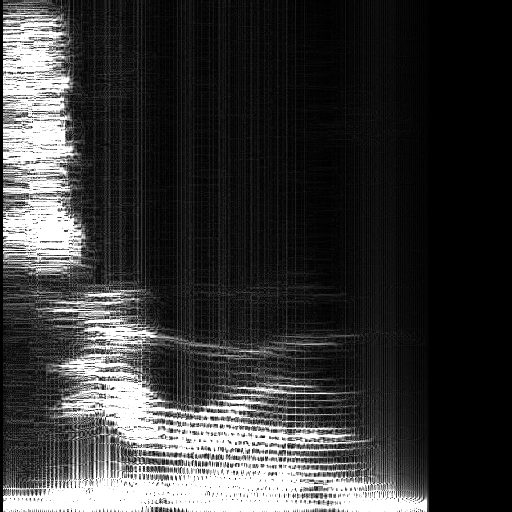
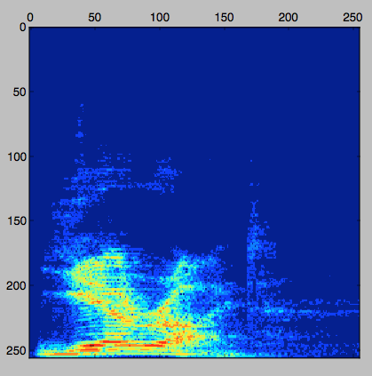

# Tensorflow Speech Recognition
Speech recognition using google's [tensorflow](https://github.com/tensorflow/tensorflow/) deep learning framework, [sequence-to-sequence](https://www.tensorflow.org/versions/master/tutorials/seq2seq/index.html) neural networks.

Replaces [caffe-speech-recognition](https://github.com/pannous/caffe-speech-recognition), see there for some background.


## Update **Mozilla** released [DeepSpeech](https://github.com/mozilla/DeepSpeech)
They achieve good [error rates](http://doyouunderstand.me). Free Speech is in good hands, go *there* if you are an end user.
For now *this* project is only maintained for educational purposes.


## Ultimate goal
Create a decent standalone speech recognition for Linux etc.
Some people say we have the models but not enough training data.
We disagree: There is plenty of training data (100GB [here](http://www.openslr.org/12) and 21GB [here on openslr.org](http://www.openslr.org/7/) , synthetic Text to Speech snippets, Movies with transcripts, Gutenberg, YouTube with captions etc etc) we just need a simple yet powerful model. It's only a question of time...



Sample spectrogram, Karen uttering 'zero' with 160 words per minute.
## Installation
### clone code
```
git clone https://github.com/pannous/tensorflow-speech-recognition
cd tensorflow-speech-recognition
git clone https://github.com/pannous/layer.git
git clone https://github.com/pannous/tensorpeers.git
```

### pyaudio
#### requirements portaudio from http://www.portaudio.com/
```
git clone  https://git.assembla.com/portaudio.git
./configure --prefix=/path/to/your/local
make
make install
export LD_LIBRARY_PATH=$LD_LIBRARY_PATH:/path/to/your/local/lib
export LIDRARY_PATH=$LIBRARY_PATH:/path/to/your/local/lib
export CPATH=$CPATH:/path/to/your/local/include
source ~/.bashrc
```
#### install pyaudio
```
pip install pyaudio
```

## Getting started

Toy examples:
`./number_classifier_tflearn.py`
`./speaker_classifier_tflearn.py`

Some less trivial architectures:
`./densenet_layer.py`

Later:
`./train.sh`
`./record.py`



<!-- ╮⚆ᴥ⚆╭ -->

Update: Nervana [demonstrated](https://www.youtube.com/watch?v=NaqZkV_fBIM) that it is possible for 'independents' to build speech recognizers that are state of the art. 
<!-- ᖗ*﹏*ᖘ -->

### Fun tasks for newcomers
* Watch video : https://www.youtube.com/watch?v=u9FPqkuoEJ8
* Understand and correct the corresponding code: [lstm-tflearn.py](/lstm-tflearn.py) 
* Data Augmentation :  create on-the-fly modulation of the data: increase the speech frequency, add background noise, alter the pitch etc,...
<!-- ᕮ◔‿◔ᕭ -->

### Extensions 
**Extensions** to current tensorflow which are probably needed:
* [WarpCTC on the GPU](https://github.com/baidu-research/warp-ctc/tree/master/tensorflow_binding) see [issue](https://github.com/tensorflow/tensorflow/issues/2146)
* Incremental collaborative snapshots ('[P2P learning](https://github.com/pannous/tensorpeers)') !
* Modular graphs/models + persistance
<!-- ⤜(⨱ᴥ⨱)⤏ -->

Even though this project is far from finished we hope it gives you some starting points.

Looking for a tensorflow collaboration / consultant / deep learning contractor? Reach out to [info@pannous.com](mailto:info@pannous.com?subject=contractor)
<!--
 Notes
STT https://github.com/sotelo/parrot/blob/master/model.py t
 parrot

-->
